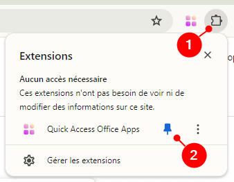
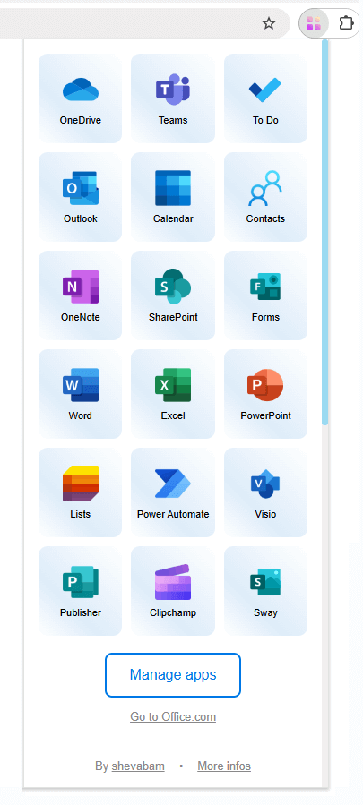
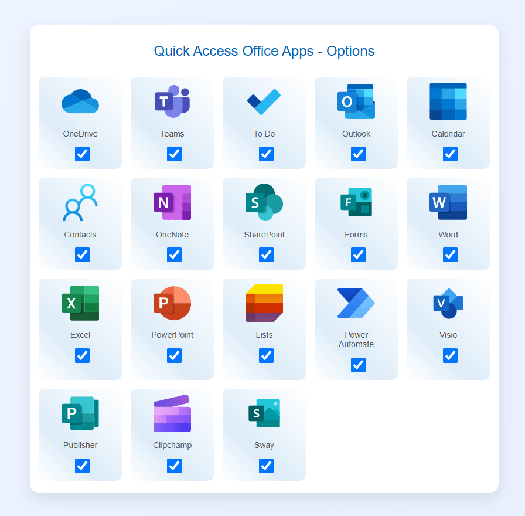

# Browser extension "Quick Access Office Apps"

Access your favorite Office 365 applications in one click with **Quick Access Office Apps**!

# Install

Install this extension from [**Chrome Web Store**](https://chromewebstore.google.com/detail/quick-access-office-apps/klhgficbeigdebndgcllhangmblmibpb) or [**Microsoft Edge Store**](https://microsoftedge.microsoft.com/addons/detail/quick-access-office-apps/nlbbmcemoiejcomippnljcdmgojgmamm).

# Usage

After installing the extension, pin it to your browser:

# Settings

By default, all configured Office 365 applications are available:

Available apps: 

* OneDrive
* Teams
* To Do
* Outlook
* Calendar
* Contacts
* OneNote
* SharePoint
* Forms
* Word
* Excel
* PowerPoint
* Lists
* Power Automate
* Visio
* Publisher
* Clipchamp
* Sway

You can manage your applications (add, delete) from the options panel by clicking on the “Manage apps” button:

# Feedback

If you have a problem using this extension, or would like to request an enhancement, feel free to create an issue or say hello on [Twitter/X](https://twitter.com/shevabam)!

# Privacy Policy

The extension does not collect any user information or other information. Only extension-related parameters are stored.
